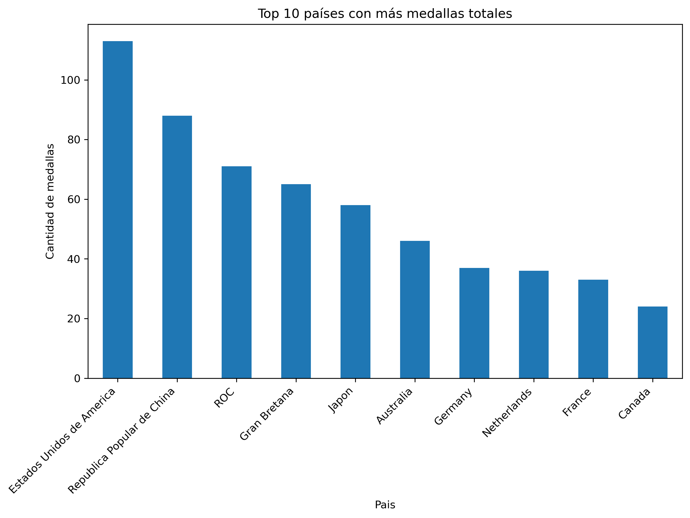
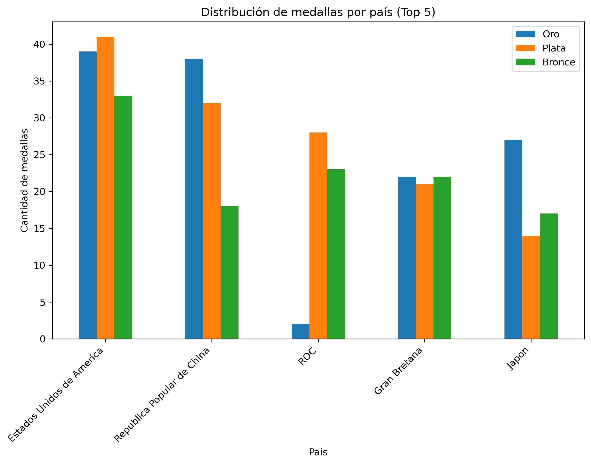
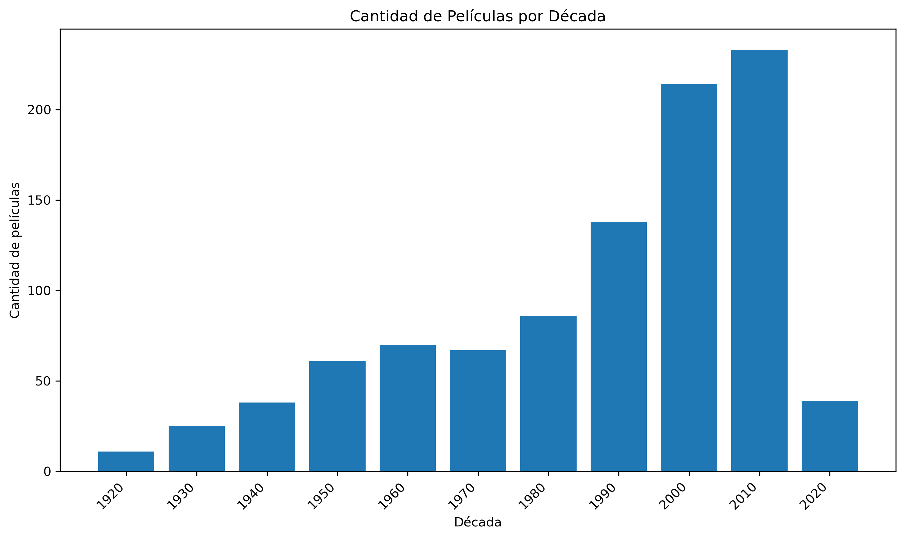
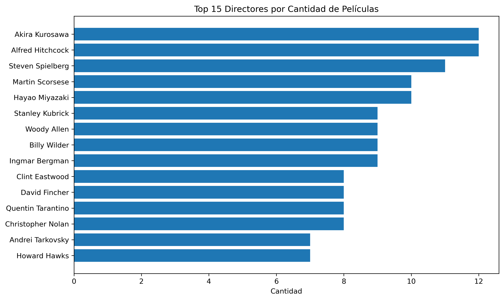
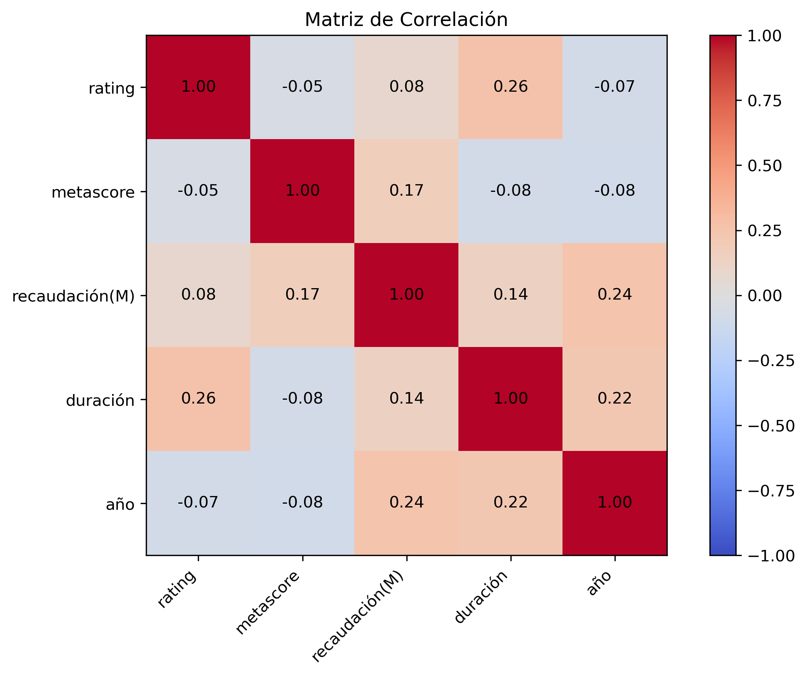

# 📊 Python Data Analysis

  
  
  
  

Este repositorio contiene un flujo de trabajo completo para el **análisis de datos de ventas** utilizando Python.  
El objetivo es mostrar paso a paso cómo transformar datos crudos en información lista para el análisis, con notebooks bien documentados y datasets organizados.  

---

## 📂 Estructura del repositorio

```text
Python_Data_Analysis/
│
├── Data/
│   ├── Ventas.csv
│   ├── Ventas_clean.csv
│   ├── medallas.csv
│   ├── medallas_clean.csv
│   ├── Top-Películas.csv
│   ├── Top-Películas_clean.csv
│   └── Dataset Mundiales.csv
│
├── Notebooks/
│   ├── 01_data_cleaning.ipynb
│   ├── 02_data_analysis.ipynb
│   ├── 03_visualizations.ipynb
│   └── 04_modeling.ipynb
│
├── Images/
│   ├── preview_top10.png
│   ├── preview_top5.png
│   ├── dist_rating.png
│   ├── dist_duracion.png
│   ├── scatter_rating_metascore.png
│   ├── scatter_rating_recaudacion.png
│   ├── top_directores.png
│   ├── boxplot_duracion_genero.png
│   ├── peliculas_por_decada.png
│   ├── rating_promedio_por_anio.png
│   ├── heatmap_correlaciones.png
│   ├── goles_promedio_mundiales.png
│   ├── top10_victorias.png
│   ├── partidos_penales.png
│   └── modelo_mundiales_confusion.png
│
└── README.md


```
---

## 📓 Notebooks

### 01_data_cleaning.ipynb
- Conversión de fechas a formato datetime.  
- Normalización de categorías en la columna Producto.  
- Detección de valores faltantes y registros duplicados.  
- Verificación de consistencia: Total Venta = Cantidad * Precio Unitario.  
- Exportación de dataset limpio → Ventas_clean.csv.  

### 02_data_analysis.ipynb
- Limpieza adicional de datos del medallero olímpico.  
- Conversión segura de columnas numéricas (manejo de valores no válidos).  
- Métricas descriptivas: Top 10 países por medallas de oro y medallas totales.  
- Visualizaciones:
  - 📊 Gráfico de barras: Top 10 países con más medallas totales.  
  - 🥇 Comparación Oro, Plata y Bronce en los 5 países principales.
    
### 03_visualizations.ipynb

**Aspectos técnicos**
- Distribuciones de `rating` y `duración`.
- Relaciones: `rating` vs `metascore` y `rating` vs `recaudación(M)`.
- Comparaciones: Top directores (barh) y boxplot de duración por género.
- Tendencias: películas por década y rating promedio por año.
- Matriz de correlación (Pearson) entre variables numéricas.
  - `rating`–`metascore`: -0.06 (casi nula)
  - `rating`–`duración`: +0.27 (débil positiva)
  - `metascore`–`recaudación(M)`: +0.18 (leve positiva)
  - `año`–`duración`: +0.22 / `año`–`recaudación(M)`: +0.25

**Análisis e insights**
- La distribución de **ratings** se concentra entre 6 y 8 puntos.  
- Las películas han tendido a ser más largas en décadas recientes.  
- Crítica y público no siempre coinciden: la correlación entre **rating y metascore** es casi nula (-0.06).  
- Las películas más largas tienden a tener un **rating levemente mejor** (+0.27).  
- La recaudación muestra una correlación leve con el año (+0.25), reflejando el crecimiento del mercado y la inflación.  

### 04_modeling.ipynb
- **EDA histórico de los Mundiales:**
  - Promedio de goles por partido a lo largo del tiempo.
  - Top 10 selecciones con más victorias.
  - Cantidad de partidos definidos por penales por torneo.
- **Modelo predictivo simple:**
  - Variables: equipos, año, fase del torneo.
  - Algoritmo: Árbol de Decisión (max_depth=5).
  - Se evaluó con un conjunto de test → se generó matriz de confusión.

---

## 🚀 Roadmap
- [x] 01_data_cleaning.ipynb → Limpieza y normalización.  
- [x] 02_data_analysis.ipynb → Métricas descriptivas y primeras visualizaciones.  
- [x] 03_visualizations.ipynb → Gráficos avanzados y storytelling con datos.  
- [ ] 04_modeling.ipynb → (opcional) Modelos predictivos simples.  
  

---

## ⚙️ Requisitos

Este proyecto usa Python 3 y las siguientes librerías:  

```bash
pip install pandas numpy matplotlib seaborn
```
- `pandas` → Manipulación de datos  
- `numpy` → Operaciones numéricas  
- `matplotlib` / `seaborn` → Visualización (para siguientes etapas)  

---

## ✨ Autor

**Luciano Mosquén**  
🔗 [LinkedIn](https://www.linkedin.com/in/lucianomosquen)  
🌐 [GitHub](https://github.com/lucianomosquen)  

---


## 📸 Preview











